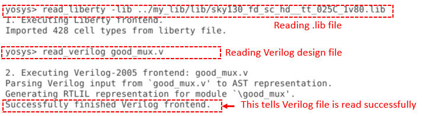

# Sky130-RTL-Design-And-Synthesis-Using-Verilog

This repository shows the contents  and labs covered in the [RTL Desing using Verilog with Sky130 Technology](https://www.vlsisystemdesign.com/rtl-design-using-verilog-with-sky130-technology/) workshop.


# Table of Contents

- [Introduction](#Introduction)
- [Day1 - Introduction to Verilog RTL Design and Synthesis](#Day1---Introduction-to-Verilog-RTL-Design-and-Synthesis)
   1. [Introduction to iverilog, Design and Test Bench](#Introduction-to-iverilog-,-Design-and-Test-Bench)
   2. [Simulating the Designs with iverilog](#Simulating-the-Designs-with-iverilog)
   3. [Design and Test Bench setup](#Design-and-Test-Bench-setup)
   4. [iverilog Simulation Flow](#iverilog-Simulation-Flow)
   5. [Setting Up the Lab](#Setting-Up-the-Lab)
   6. [Iverilog Simulation of Multiplexer(MUX)](#Iverilog-Simulation-of-Multiplexer(MUX))
   7. [Synthesis with Yosys](#Synthesis-with-yosys)

- [Acknowledgements](#acknowledgements)
- [References](#references)


# 1. Introduction :
Tools used:   
* Icarus Verilog: It is a verilog simulation and synthesis tool. It operates as a compiler, compiling source code written in Verilog (IEEE-1364) 	       			  into some target format.Icarus Verilog is an open source Verilog compiler that supports the IEEE-1364 Verilog HDL including IEEE1364-				  2005 plus.
* GTKwave	: GTKWave is a VCD waveform viewer based on the GTK library. This viewer support VCD and LXT formats for signal dumps.It also reads LXT, LXT2, VZT, 		      FST, and GHW files as well as standard Verilog VCD/EVCD files and allows their viewing.
* Yosys 	: Yosys is a framework for Verilog RTL synthesis. It currently has extensive Verilog-2005 support and provides a basic set of synthesis algorithms 			for various application domains.
Technology used: Sky130 technology.   
	
# 2. Day1 - Introduction to Verilog RTL Design and Synthesis
The first day of the workshop covers the brief description of iverilog simulator, Test Bench setup, iverilog simulation flow  and lab using iverilog, gtkwave, yosys tools.
## 2.1 Introduction to iverilog, Design and Test Bench	
* RTL Design : It is the actual verilog code or set of verilog codes which has intended functionality to meet with the required specifications.
		Register Transfer Level (RTL) is an abstraction for defining the digital portions of a design. It is the principle abstraction used for 			defining electronic systems today and often serves as the golden model in the design and verification flow. The RTL design is usually 				captured using a hardware description language (HDL) such as Verilog or VHDL.
	
* Test Bench : It is the setup to apply stimulus(test_vectors) to the design to check its functionality. So to ensure that our design is obeying the 		  		required specification, we apply stimulus to the design ,observe its output and match it with respect to the specification.
	
	
## 2.2 Simulating the Designs with iverilog
* Simulation : Simulation is the process by which the design model coded in the HDL gets executed (after a successful compilation and elaboration) based on a given 		   execution model.It is done by using a simulation software (simulator) to verify the functional correctness of a digital design that is modeled using 	      a HDL (hardware description language) like VHDL,Verilog. It is the process of checking whether the design is adhering to the given specs.
		
* Simulator : It is the tool used for simulating the design.The simulator used here is "iverilog". The RTL design is the implementation of the required 	   		specification and the functionality of the specs needs to be verified by simualting the design using simulator.
	
* How does a simulator work ?
   Simulator works by continuously monitoring the changes in the inputs. Upon a change in any one of the inputs, the output is re-evaluated. If there is no 	     	change in input, the ouput will not be evaluated. Simulator dumps the change to the ouput to a file according to the change in input.
    
## 2.3 Design and Test Bench setup
 * The RTL design written in verilog code has some primary inputs and primary outputs. It may have one or more than one primary inputs and one or more 	    	      than one primary outputs.
 * We need to give stimulus to all the primary inputs and need to observe the primary outputs. Thus we need stimulus generator at the input and stimulus 	observer at the output.
 * For giving stimulus we write the test bench, for that the design(module) is instantiated in the test bench, then stimulus is applied.
 * It is important to note that the test bench doesn't have any primary input and primary output.
 <dl>
  <dd>Below image shows the test bench set : </dd>
 </dl>
 
	
 	
## 2.4 iverilog Simulation Flow
* Inputs to the simulator :  
    The iverilog simulator accepts two main inputs.  
	1. RTL Design    : This is the behavioral description of the specs in some HDL language(verilog here).  
        2. Test Bench    : The testbench is the setup to apply stimulus or test vectors to the design to check its functionality and correctness.
        		   Test bench instantiate the verilog module of design and give stimulus to the input ports of the RTL design.
	
* Output of the simulator :  
 The iverilog simulator outputs a value chage dump (.vcd) file as output.This vcd file can be viewed using the GTKWave viewer tool.  
<dl>
  <dd>Below image shows the complete iverilog simulation flow : </dd>
</dl>	 
 

        

## 2.5 Setting Up the Lab.
* <dl>
  <dd>Login to your lab instance and in our home directory create a directory named VLSI.: </dd>
  </dl>

``` 
$ cd /home/deepak074.verma/
$ mkdir VLSI
```

      
* <dl>
  <dd>Clone the github repository into the VLSI directory.</dd>
  </dl>
``` 
$ cd VLSI
$ git clone https://github.com/kunalg123/sky130RTLDesignAndSynthesisWorkshop.git
```

      
 * <dl>
   <dd>Check the contents of sky130RTLDesignAndSynthesisWorkshop directory</dd>
   </dl>
``` 
$cd sky130RTLDesignAndSynthesisWorkshop
$ ls -ltr
$ cd my_lib 
$ cd lib                       : Contains sky130 standard cell library
$ cd ..
$ cd verilog_model 		   : Contains verilog model of standard cells in lib directory
```

      
 * <dl>
   <dd> Check the contents of verilog_files directory which contains working files for this workshop>/dd>
   </dl>
```
$ cd sky130RTLDesignAndSynthesisWorkshop
$ ls -ltr
$ cd verilog_files
```


## 2.6 Iverilog Simulation of Multiplexer(MUX)
Iverilog simulation is done as per below steps:
*  Iverilog takes RTL design and test bench as input and generates a executable file " a.out".
*  On executing "a.out" ,it dumps the simulation in value change dump format(.vcd file).
*  Then GTKWave takes the .vcd file and display the simulation waveform.
The above steps are shown below:

1. Run iverilog with the design verilog file and the testbench as inputs. This will create an executable named a.out.
   
```
$ cd sky130RTLDesignAndSynthesisWorkshop
$ ls -ltr
$ cd verilog_files 
$ iverilog good_mux.v tb_good_mux.v
```

2. Execute the file a.out. This will generate the value change dump (.vcd) file.

```
$ ./a.out
```
3. Now run GTKwave with the vcd file as input to view the simulation waveform.
```
$ gtkwave tb_good_mux.vcd
```
4. To view the signal on the wave window click and drag them to the signal column..


  		
     
## 2.7 Synthesis with Yosys
Synthesis : Synthesis is the process during which RTL design actually gets converted into a circuit. There are special programing languages called Hardware 		      Description Languages (HDLs) which are used to describe the hardware of a circuit and then the computer makes the circuit based on the program 	
 	      written. After synthesis we obtain something known as a “Gate Level Netlist”. This netlist is how our circuit will look.
	      The tool used here to do synthesis is Yosys.
In simple terms:
* It does RTL to gate level translation
* The design is converted into gates and connections are made between them.
* This gives out a file called netlist.
	      
### 2.7.1 Yosys Synthesis Flow setup
The synthesis tool takes the RTL design and the liberty file(.lib) as inputs and synthesize the RTL design into netlist which is the gate level representation of the RTL design.

Below image shows the Yosys synthesis flow setup: 
  
   
Below are the steps to synthesize the multiplexer design(good_mux.v):
1. To invoke Yosys:   
```
$ cd verilog_files
$ yosys
```
Below image show the yosys synthesis suite:


2. Reading sky130 standard library :
```
$ read_liberty -lib ../my_lib/lib/sky130_fd_sc_hd__tt_025C_1v80.lib  
```
read_liberty : It read cells from liberty file as modules into current design.
	       The option "-lib"  only create empty blackbox modules.
	       
3. Reading the RTL design(verilog file) :
```
$ read_verilog good_mux.v  
```
read_verilog : This command is used to read the verilog desgin file. It load modules from a Verilog file to the current design.
Below image show the yosys synthesis suite:


4. Synthesize the top level module  : Below command is used to synthesize the module
```
$ synth -top good_mux  
```
synth : This command runs the default synthesis script. This command does not operate on partly selected designs.
-top <module> : This option use the specified module as top module (default='top'). Here we have module name "good_mux" for our example.
	

	
5. Mapping to the standard library 
```
$ abc -liberty ../my_lib/lib/sky130_fd_sc_hd__tt_025C_1v80.lib
```
abc : This pass uses the ABC tool for technology mapping of yosys's internal gate library to a target architecture. This command converts RTL code into 	    	gates,cells which is taken from the sky130_fd_sc_hd__tt_025C_1v80.lib file.
-liberty <file> : It generate netlists for the specified cell library (using the liberty file format).
	

	
6. To view the result as a grapviz use below command
```
$ show
``` 
Show : It creates  graphviz DOT file for the selected part of the design and compile it to a graphics file (usually SVG or PostScript).It is used to show 
		the logic realized from the verilog code after synthesis.
	
 
	
7. To write the  netlist to a file use below command which  will output the netlist to a file in the current directory.
 ```
 $ write_verilog -noattr good_mux_netlist.v
 ```
write_verilog : It write the current design to a Verilog file.
-noattr :By using this option no attributes are included in the output.
good_mux_netlist.v : File name to which we want to write the netlist.It can be any name.
	

	
### 2.7.2 Verifying the Synthesis output netlist:
The netlist is written as a verilog code in terms of standard cell from sky130_fd_sc_hd__tt_025C_1v80.lib. As the netlist is the true representation of the 	    RTL design ,it needs to be simulated to verify ,if tool has synthesized our design correctly.
To simulate the generated netlist follow the same iverlog simulation flow done above. The only change in the input of iverilog is the netlist file is used 	   in place of RTL design.
The set of primary inputs & ouputs will remain same for RTL design and synthesized netlist.Thus same test bench can be used.
	
	
# 3. Day2 - Timing libs, hierarchical vs flat synthesis and efficient flop coding styles
## 3.1 Introduction to Timing .libs :
### 3.1.1 Library naming convention :
There are seven standard cell libraries provided directly by the SkyWater Technology foundry available for use on SKY130 designs, which differ in intended applications and come in three separate cell heights. In this workshop we are using the "sky130_fd_sc_hd__tt_025C_1v80.lib" library.The sky130_fd_sc_hd library is designed for high density. This library enables higher routed gated density, lower dynamic power consumption, and comparable timing and leakage power. As a trade-off it has lower drive strength.Libraries in the SKY130 PDK are named using the following scheme:
```
<Process name> _ <Library Source Abbreviation> _ <Library Type Abbreviation> [_ <Library Name>]	
```
Lets break down the terms in our library name - sky130_fd_sc_hd__tt_025C_1v80.lib
	
* Sky130 : It is the name of the process technology.
* fd     : It is abbreviation for who created and is responsible for the library, here the SkyWater Foundry.
* sc 	 : It is abbreviation for the type of content found in the library, here the Digital Standard Cells.
* hd	 : It represents high density
* tt	 : It shows the typical process corner.
* 025c   : It shows the temperature(25C)
* 1v80	 : It shows the operating process voltage.

### 3.1.2 Liberty file(.lib) :
Liberty files are a IEEE Standard for defining PVT Characterization, Relating Input and Output Characteristics, Timing, Power, Noise parameter associated with cells inside the standard cell library of a particular technology node. Liberty is an ASCII format, usually represented in a text file with extension ".lib". It is an industry standard format used to describe library cells of a particular technology. It is a collection of logic module/Standard cells. It includes different types of gates and different flavours of these gates.
	
Below image show some details of our sky130_fd_sc_hd__tt_025C_1v80.lib :

	
Lets see few cell definitions inside the .lib file as shown in below image.


We can see cell "sky130_fd_sc_hd__a21110_1" .This cell implements logic function with 5 inputs. The logic implemenst AND of first two inputs ,ORed with other inputs. The cell definition also shows amount of leakage power for different combinations of 5 inputs(32 combinations here).

Also lets see different flavours of same cell in the .lib file.


As per above image, we can find that different flavours of  "AND" gate has different size ,area, power consumption. Below details hsows the comparison between these different " AND " gates:
```
Area  : and2_0  < and2_2 < and2_4
Power : and2_0  < and2_2 < and2_4 
Delay : and2_0  > and2_2 > and2_4
```
We can see and2_4 has wider area and and2_0 has less area. Thus as per observations of different sizes of cells we can conclude:
* Larger cells have wider transistors, thus more area, more power consumption but are faster cells(less delay).
* Smaller cells have thin transistors, thus less area, power consumptions but are slower (more delay). 
	
## 3.2 Hierarchical and Flat synthesis
3.2.1. Hierarchial synthesis
We have a RTL design where we have two sub modules, both instantiated inside top module as shown in below image:


As per above RTL code we expect the netlist will consist of AND and OR gates from library. But lets see the synthesis result as shown below.We can see that synthesis has preserved the hierarchy as it uses sub-modules in place of gates in the design hierarchy of multiple modules a per below synthesis result.

	
lets see the netlist generated by abc tool after synthesis. We can see that netlist hierarchy is preserved as sub_modules u1 and u2 are inferred in place of gates as expected as per RTL code.

	
3.2.2. Flat Synthesis 
To flatten the design yosys command " Flatten" is used. 
Flatten :This pass flattens the design by replacing cells by their implementation. This pass is very similar to the 'techmap' pass. The only difference is that this
pass is using the current design as mapping library.Cells and/or modules with the 'keep_hierarchy' attribute set will not be flattened by this command.
	
After performing synthesis and generating netlist we will flatten the desing to see if heirarchies are flatten out and gates are instantiated in netlist inplace of submodules.
```
$ read_liberty -lib ../my_lib/lib/sky130_fd_sc_hd__tt_025C_1v80.lib 
$ read_verilog multiple_modules.v
$ synth -top multiple_modules
$ abc -liberty ../my_lib/lib/sky130_fd_sc_hd__tt_025C_1v80.lib
$ write_verilog -noattr multiple_modules_hier.v			: to write hierarchical netlist
$ Flatten							: to flatten the design
$ write_verilog -noattr multiple_modules_Flat.v			: to write flattened netlist
```
	
Below image shows the difference between the Hierarchical and flatten synthesized netlist:


Below image show the generated netlist when desing is flattened:


## 3.2.3 Submodule Level Synthesis :
When we have multiple sub modules in  top level module, sub module level syntheis can be done. The reason for sub module synthesis is done is mentioned below :
* In case of top module having multiple instances of same submodule, synthesis of a submodule helps to synthesize single instance and using it for the other instances. It saves time as only sinle instanc ehave to be instantiated.
* For large designs, divide and conquer approach is followed to synthesize submodules which helps in reducing load on synthesis tool.

For same example "multiple_modules.v " ,to understancd sub module synthesis better, synthesize only sub_module1 and observe how the synthesized netlist appears.
```
$ read_liberty -lib ../my_lib/lib/sky130_fd_sc_hd__tt_025C_1v80.lib 
$ read_verilog multiple_modules.v
$ synth -top sub_module1
$ abc -liberty ../my_lib/lib/sky130_fd_sc_hd__tt_025C_1v80.lib
$ write_verilog -noattr multiple_modules_sub.v			
```
After synthesis we have find out that synth command just looks at the specified sub_module1 alone and sub_module2 is ommitted from synthesis.

Below images show the sub module synthesis of sub_module1:


Below images show the sub module synthesize netlist:
	

## 3.3 Flop coding styles and optimization
Before going into coding style design of Flip flop we need to understand why flip flops are required.
	
Lets consider a combinational circuit. Each gate has a  delay associated to it. Any change in its input take some finite amount of time (called propagation delay) to propagate to its output. A combinational circuit with gates whose delays are different result in unwanted transitions in the outputs for changes in the input. These are called ``` Glitch  ```.

Let take below combinational circuit. From boolean algebra we know that the output of this should always be 1. But, in reality this may not happen as can bee seen from the timing diagram on the right.

 
We can say more the amount of combinational circuit in the design ,the output will have more glitches.

**Avoiding Glitches** : To avoid glitches, we want a element which can store the value of combinational circuit, i.e. Flipflops. We can use flops to restrict glitches by storing the value in flops. Flipflops are storage elements. Their outputs will change only on the edge of clock. Between edges, the output is completely isolated from the inputs.As the flop ouptuts only reflect the input on a clock edge ,if we add flops between our combinational paths, we can prevent glitches from chaining up and causing unstable outputs. Thus, combinational circuit will see stable inputs and outputs.Thus flops act as barriers at the input of the combinational circuit, giving its output time to settle after a change in the inputs.

**NOTE** : While coding the flip flops, its important to specify the initial states of the flops. Since the output of the flops are input to a combinational circuit, if initila state is not specified/unknown, this may result in the combinational logic evaluating to some garbage value. For the designer,there should have some control pin to to control the initial values of the flop to avoid such cases. For this we have two pins in flops , RESET and SET. RESET would set the flop output to 0 and SET would set the flop output to 1. Both can be done asynchronously or synchronous with respect to the clock.

	
	
### 3.3.1 Different Flop coding styles

1. Asynchronous reset D-Flip flop


While synthesizing RTL code for flops we need to use command "dfflibmap - liberty ../my_lib/lib/sky130_fd_sc_hd__tt_025C_1v80.lib". This is beacuse in the library flow, there will be separate library for flops and standard cells. So we need to explicitly tell the tool where to pickup flops in the design from. In our case we have same library for both , so we have used same library path for invoking dfflibmap command.

Synthesizing Asynchronous reset D-Flip flop (dff_asyncres.v)
```
$ read_liberty -lib ../my_lib/lib/sky130_fd_sc_hd__tt_025C_1v80.lib 
$ read_verilog dff_asyncre.v
$ synth -top dff_asyncres
$ dfflibmap -liberty ../my_lib/lib/sky130_fd_sc_hd__tt_025C_1v80.lib
$ abc -liberty ../my_lib/lib/sky130_fd_sc_hd__tt_025C_1v80.lib
$ show		
```
	
	
2. Asynchronous set D-Flip flop

	
3. Synchronous reset D-Flip flop

	
4. Asynchronous & Synchronous reset D-Flip flop

	
**NOTE**: There can be the case when we have asynchronous and synchronous reset(as in last flop coding style shown above) together, it will not cause race condition. But if the desing have both reset and set ,it may cause race condition.
	
	
		
# 4. Day3 - Combinational and Sequential optimizations
## 4.1 Introduction to Optimizations:
**Logic Optimization** :
It is the process of finding an equivalent representation of the specified logic circuit under one or more specified constraint. Optimization is the process of iterating through a design such that it meets timing, area and power specifications.The purpose of logic optimization is to enhance the simulation efficiency. A typical optimization process consists of the transformations,as each gate corresponds to one or more statements in the compiled code, logic optimization reduces the program size and execution time.

## 4.2 Combinational Logic Optimizations:
The logics optimization squeezes the logic to get the most optimized design. The optimized design is then efficient in terms of area and power saving.
These are some common techniques used for optimizing combinational logic :
* Constant Propagation 
	* Direct Optimization technique
* Boolean Logic Optimization.
	* Karnaugh map
	* Quine Mckluskey
### 4.2.1 Constant Propagation:
Constant propagation is the process of substituting the values of known constants in expressions. Constant propagation eliminates cases in which values are copied from one location or variable to another, in order to simply assign their value to another variable. The constant inputs to the circuit is  propagated to the output which results in a minimized expression of the logic.
Below image show propagation of constant input to the output:


### 4.2.2 Boolean Logic Optimization:
In terms of Boolean algebra, the optimization of a complex boolean expression is a process of finding a simpler one, which would upon evaluation ultimately produce the same results as the original one. This technique uses boolean algebra rules/theorems to minimize the logic.
Below image shows the example of optimization of given boolean logic:

	
## 4.3 Sequential Logic Optimizations
Below are the techniques used for optimizimg the sequential logic :
* Basic Tecnique
	* Sequential Constant Propagation
* Advanced Technique
	* State Optimization
	* Retiming
	* Sequential Logic cloning(Floorplan aware synthesis)
### 4.3.1 Sequential Constant Propagation
1. lets take an exmaple to understand this optimization technique aa per below image:


We can see that the output Y will always be at '1' irrespective of CLK, reset, A , Q becaue of sequential constant.

2. There are cases where sequential constant propagation do not apply
A constant connected to the input of a flop does not mean that we can always optimize it out. 

	
### 4.3.2 Advanced Techniques
1. State Optimization : it is used  for Optimization of unused states.
	
2. Sequential Logic cloning : It is done when we are using physical aware synthesis.

3. Retiming : It is done to reduce combinational delay and to improve the performance of the circuit.
	
	
## 4.4 Logic optimizations with Yosys
	
### 4.4.1 Combinational Logic Optimizations:
To understand optimization with yosys, lets take an exmaple of opt_Check4.v :


### 4.4.2 Sequential Logic Optimizations
To understand optimization with yosys, lets take an exmaple of dff_const5.v :
In the below circuit we can see that the circuit obatained after synthesis and optimization is similar to what we expected as per RTL code. Thus in this case no optimization is possible. 


## 4.5 Sequential optimizations for unused outputs :
Lets take an exmaple code counter_opt.v to understand this case:


At first going through code, we might be think that the design would contain 3 flops after synthesis as it seems to be a 3-bit counter. But, if we look closely, after a reset the value of count is 000 .The value of count is increasing on positive edge of clock bu the Output q is simply following count[0] as per code and its simulation result. 
On synthesizing we get the optmized circuit , in which we can  that only on e flop is inferred for the code and the output of flop ,Q is count[0]. The input to the flop is compliment of output.
	
Thus we can say that, the logic which is no way related to primary output will be optimized by synthesis tool.


	
# 5. Day4 - GLS, blocking vs non-blocking and Synthesis-Simulation mismatch
	
## 5.1 GLS concepts and flow using iverilog :
	
**Gate Level Simulation(GLS)** : Gate level simulation is used to boost the confidence regarding implementation of a design and can help verify dynamic circuit behaviour, which cannot be verified accurately by static methods. It is a significant step in the verification process.
Gate level simulation overcomes the limitations of static-timing analysis and is increasingly being used due to low power issues, complex timing checks, design for test (DFT) insertion at gate level and low power considerations.

The term "gate level" refers to the netlist view of a circuit, usually produced by logic synthesis. So while RTL simulation is pre-synthesis, GLS is post-synthesis. The netlist view is a complete connection list consisting of gates and IP models with full functional and timing behavior.
In this test bench is run with "Synthesized Netlist" as Desing under test(DUT). As, the netlist is logically same as the RTL code, same test bench can be used whic is used for RTL simulation.

* Why gate level simulation is done?
It is done for the following reasons:
	* To verify the logical correctness of the design after synthesis.
	* To ensure the timing of the design is met. For this GLS need to run with delay annoatation(Timing aware GLS).

## 5.2 GLS setup using iverilog :
	Below image show the inputs to the iverilog tool and output for Gate Level Simulation:
	
 
**Gate level verilog model** : It is one of the input to iverilog. It is used to tell iverilog about the standard cell models used in generated netlist after synthesis. The gate level verilog model can be :
* Functional : It can validates the functionality of the design alone.
* Timing aware : It can validate functinality and can ensure timing both.
	
## 5.3 Synthesis-Simulation Mismatch :
As we know, the generated netlist is the true representation of the RTL design, still we need to validate the functionality of the netist. This is because of the synthesis-simulation mismatch. This can happen because of the following reasons:
* Missing sensitivity list
* Blocking vs Non-Blocking assignment
* Non-Standard verilog coding

### 5.3.1 Missing Sensitivity list :
	
### 5.3.2 Blocking and Non-blocking assignments in verilog :
	
**Caveats with Blocking Statements** :
	
	
	

	
	

	

# 5. Day5 - If, case, for loop and for generate
'If' and 'case; staementa are used inside the 'always' block, so the variables to which we are going to assign output value in both statements should be a register variable.
	
## 5.1 If statements
Syntax:
```
if <condition_1>		: it has first / highest priority among all statements
	<statements>
else if <condition_2>		: it has it has second highest priority 
	<statements>
else 
	<statements>
```
If the condition evaluates to true (i.e. any non-zero value), all statements within that particular if block will be executed.
		
If statement is mainly used to create priority logic in terms of hardware. It can infer a MUX or priority logic based on how its coded.

** Danger/Caution with 'If' constructs** :
If "If statements" are not written correctly, it may infer latches. "Inferred latches" comes because of bad code style. The main reason for inferred latches is "incomplete if statements".
Below code show the example of "incomplete if statements" :
```
module incomp_if (input i0 , input i1 , input i2 , output reg y);
always @ (*)
   begin
       if(i0)
           y <= i1;
   end
endmodule
```
In above code,we can see that the if statement is not complete as else part is missing. As per code when i0 is 1 y is i1,It does not tell what will be the output if i0 is low, its not defined in the code clearly. So the synthesis tool will assume that if i0 is 0 , then y should retain its previous value ,which represents latch is inferred. We did not intend a latch while writing code but a latch is inferred in the circuit. "If statements" creates combinational circuit, but due the bad coding style(incomplete if statements), have sequential element latch is inferred. In combinational circuit we can not have inferred latches.
		  
## 5.2 CASE statements
The case statement checks if the given expression matches one of the expressions in the list and branches accordingly. It typically infers MUX. In comparison to ce statement.


	

    
# Acknowledgements

* Kunal Gosh, Co-Founder (VSD Corp. Pvt Ltd)
* Shon Taware, Teaching Assistant (VSD Corp. Pvt Ltd)

# References 
*http://bygone.clairexen.net/yosys/documentation.html
*https://skywater-pdk.readthedocs.io/en/main/contents/libraries/foundry-provided.html#sky130-fd-sc-hd-high-density-standard-cell-library

